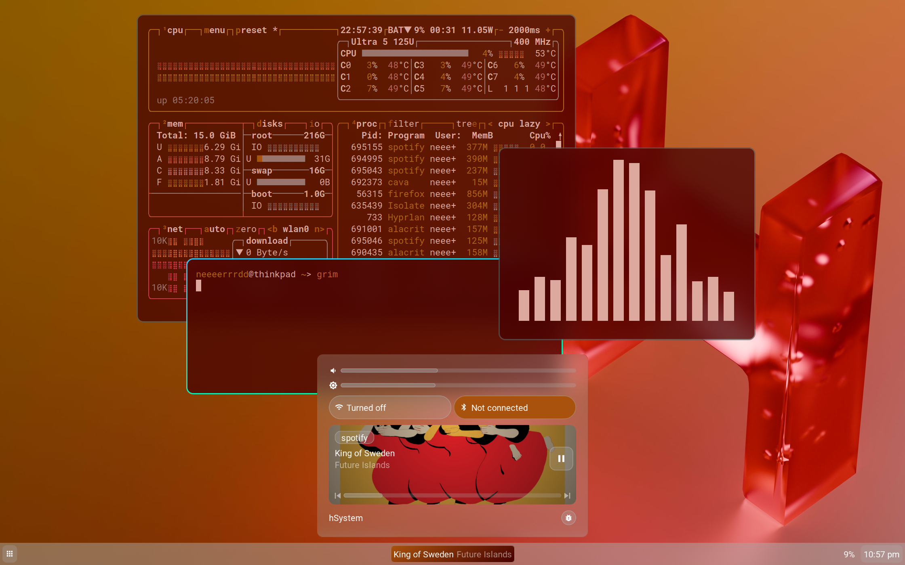

> [!WARNING]
> This operating system is **NOWHERE NEAR STABLE** and is not suitable as a daily driver.
> Unless you're a big fan of [bugs](#things-that-are-brokennot-readymissing). In which case, go for it.



# hSystem

The unofficial operating system for r/TheLetterH.

- [Arch](https://archlinux.org)-based
- Custom GTK3 based shell with [eww](https://github.com/elkowar/eww)
- [Hyprland](https://github.com/hyprwm/Hyprland) Wayland compositing

## System requirements
Any x86-64 system will work. hSystem does not support BIOS boot, and dGPUs will most likely not work properly, unless you install firmware yourself. Even then, however, NVIDIA GPUs will most likely not work.

## Installation

> [!WARNING]
> Installing hSystem onto a bare metal computer is not recommended unless you would like to use a semi-functional operating system as your daily driver.

> [!NOTE]
> Installing hSystem onto a laptop will provide the best experience, if you are going bare metal.

> [!NOTE]
> Please read these instructions fully before attempting an installation.

Download the .iso from the releases, determine the USB drive you wish to flash it to and:

On Linux, run:
```bash
sudo umount /dev/sdX
sudo dd if=hSystem.iso bs=4M conv=fsync oflag=direct status=progress of=/dev/sdX
```

On Mac, run:
```bash
diskutil unmountDisk diskX
sudo dd if=hSystem.iso of=/dev/rdiskX bs=4m status=progress
```
The `r` in `/dev/rdiskX` is not a typo, but is there to speed up the flashing of the iso.

On Windows just use [balenaEtcher](https://etcher.balena.io)

Better yet, install it into a QEMU-based VM. There are plenty of tutorials online covering how to load an iso in those, and I'm not an expert in VMs by any means, so go read/watch those.

After booting the iso, run `bash stage1.py`. It will boot you into an `archinstall` environment, where you should select your timezone, your system locale, and the disk to install hSystem to. Do not change any other options. 

It will then restart your computer, after which you will need to run `bash stage2.sh` after logging in, and then your computer will reboot one final time.

The default root password is `hSystemroot`. The default username of your user is `hsystemdefault`, whose default password is `hSystemdefault`. You can change the root user's password by typing `passwd` into a terminal. You can change the password of your user by entering `passwd hsystemdefault`. Only do this after you have completed the stage1 installer.

If you would like to rename your user, do it immediately after the stage1 installer has completed and you have rebooted. Do this by running `usermod --login newusername --move-home --home /home/newusername hsystemdefault && groupmod --new-name newusername hsystemdefault`

## Things that are broken/not ready/missing
- Playing any video or audio is unpredictable, as in tracks or videos may skip, your position may change randomly, etc. There is no known cause for this.
- Backlight brightness will set itself to 10% above 0 after reloading widgets/logging out then in occasionally. There is no known cause for this.
- The app launcher isn't themed
- Blueman is currently being used as an alternative to actually having a bluetooth widget in quicksettings
- Notifications aren't themed
- The music widget in quick settings will occasionally play/pause media from an app different from the one show
